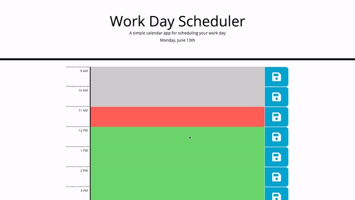

# Dan-Smith-05-Work-Day-Scheduler-Third-Party-APIs

**Description**

The daily planner enables you to organise your day.
It has a text section for every hour of the work day.

You can input your tasks for the given hour and hit the save button on the right to store them there for your future perusal.
The scheduler uses local storage so if you refresh your webpage your activities will remain.

The different hour blocks are also conditionally formatted as to make it obvious what blocks are present, past and future.

I also added a clear day button to increase the user experience.
This feature allows you to clear all the days tasks at the click of a button.

Also notice that every time you hit the save button a comment comes up to let you know your schedule was updated.
Click this notice to make it dissapear.

**Website Gif Example**

**Mockup Website Link**

Website link:
https://dansmith09.github.io/Dan-Smith-05-Work-Day-Scheduler-Third-Party-APIs/
